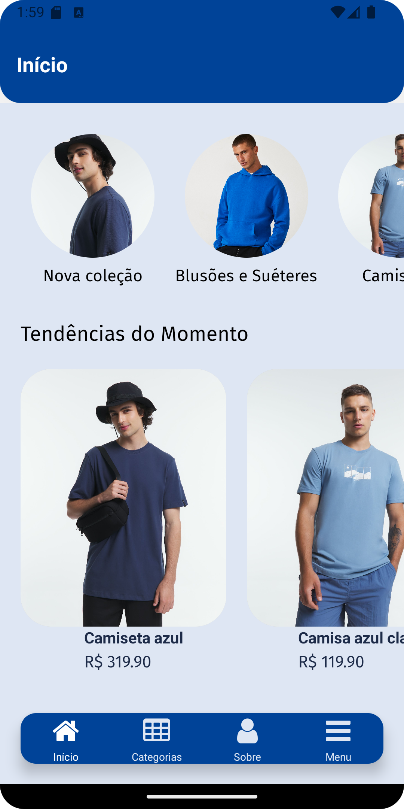
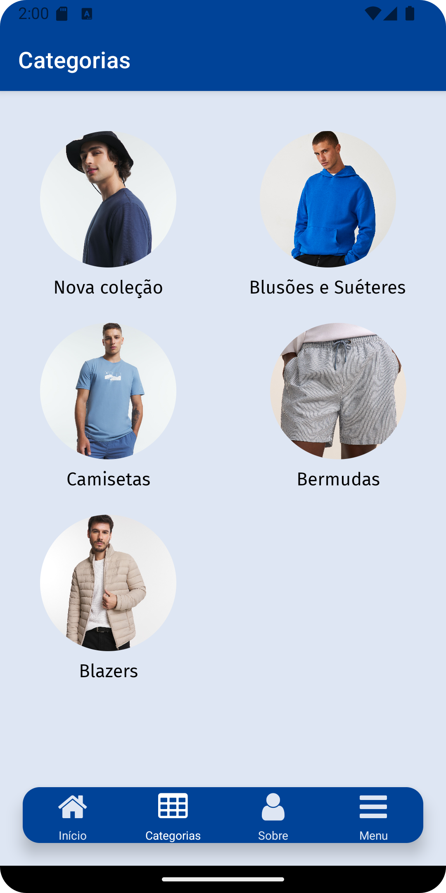
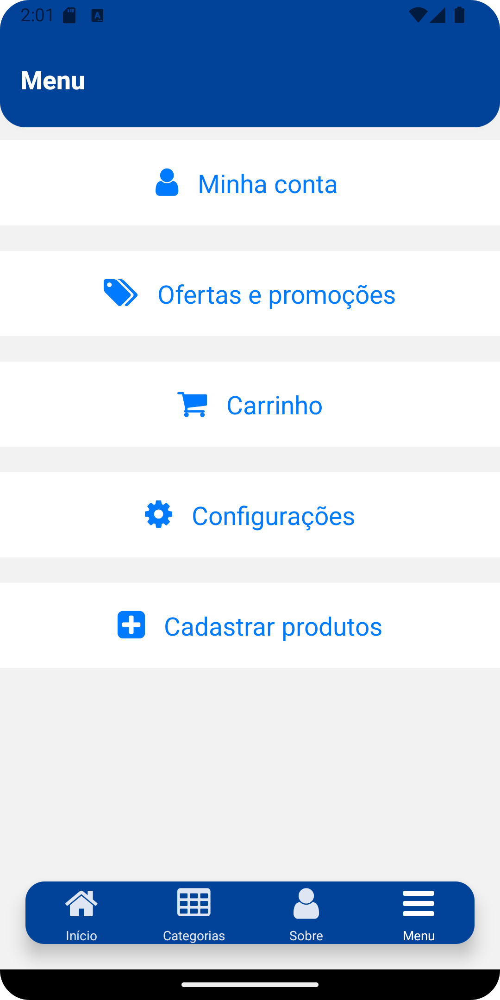
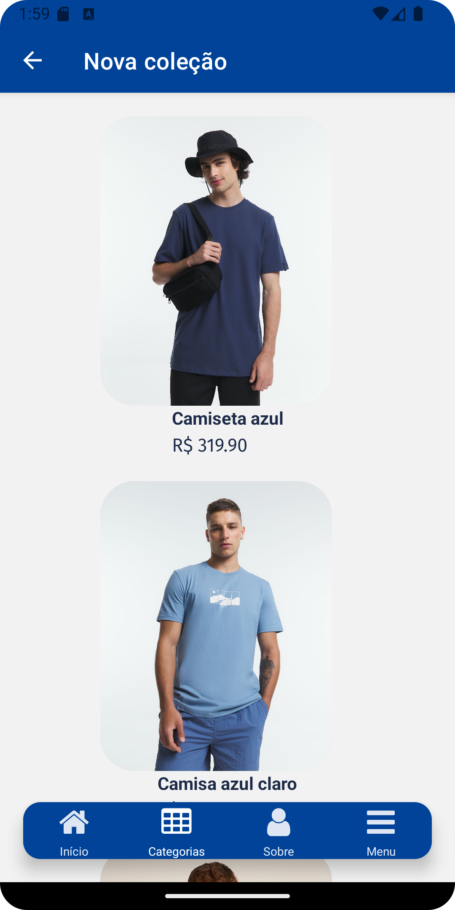
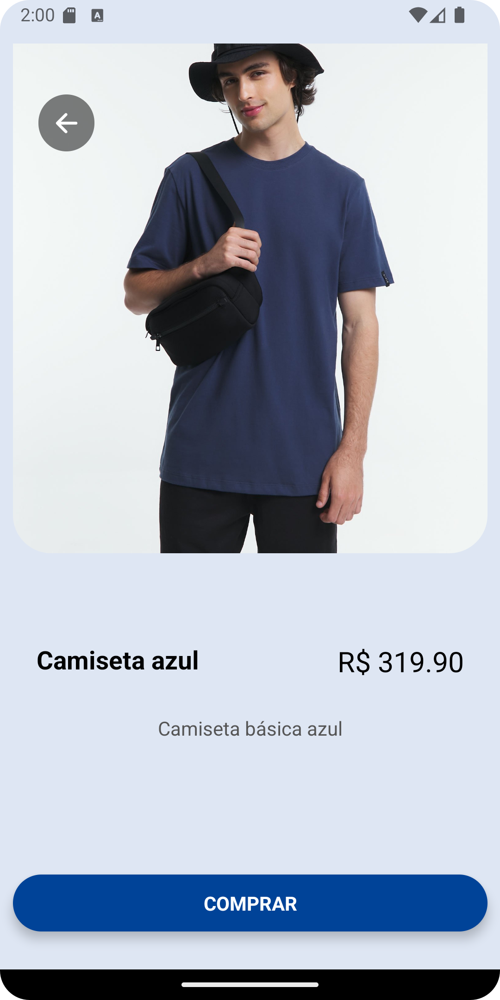
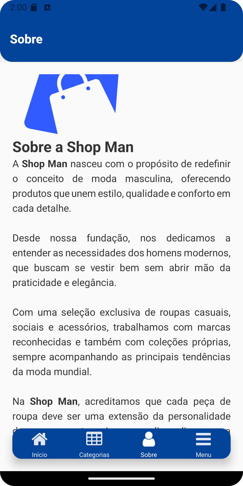
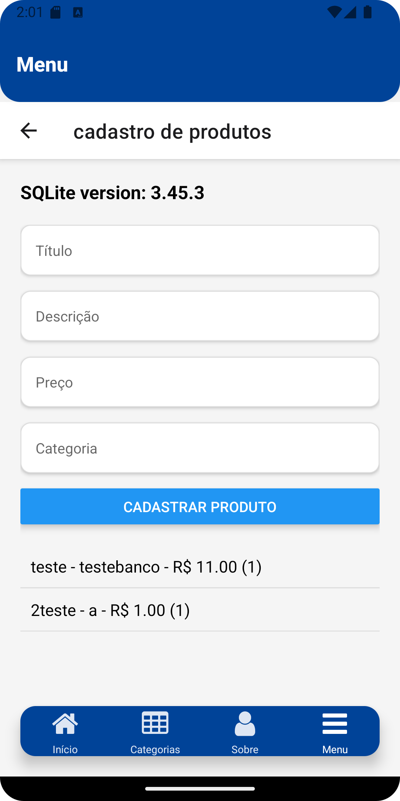

# [Loja Moda Masculina React Native]


> Descrição do projeto "Um aplicativo de loja de moda masculina, desenvolvido em React Native utilizando Expo. O objetivo é oferecer uma plataforma de compras online intuitiva, com funcionalidades de cadastro e exibição de produtos, além de integração com SQLite para armazenamento local."

[](https://github.com/SusanMarques)
[](#)
[](https://github.com/SusanMarques/Loja-moda-masculina-ReactNative/stargazers)
[](https://github.com/SusanMarques/Loja-moda-masculina-ReactNative/network/members)
[](https://github.com/SusanMarques/calculadora-electron/graphs/contributors)

## :pushpin: Sumário deste projeto

- [Título e Imagem de capa](#loja-moda-masculina-react-native)
- [Descrição do Projeto](#loja-moda-masculina-react-native)
- [Badges](#badges)
- [Índice](#pushpin-sumário-deste-projeto)
- [Features](#rocket-features)
- [Bugs](#bug-bugs)
- [Contribuição](#tada-contribuição)
- [Licença](#closed_book-licença)

<br />

## :rocket: Features

- Aplicativo de moda masculina com as seguintes funcionalidades:

1. **Cadastro de Produtos:**
   - Inserção de produtos com nome, descrição e preço.
2. **Exibição de Produtos:**
   - Interface amigável para visualizar as categorias e produtos disponíveis.
3. **Armazenamento Local:**
   - Integração com SQLite para gerenciar o cadastro de produtos e armazenamento local.
4. **Carrinho de Compras:**
   - Funcionalidade para adicionar produtos ao carrinho e finalizar a compra.

# :framed_picture: UI Interface do Usuário

<p align="left">
     
</p>
<p align="left">
     
</p>
<p align="left">
     
</p>
<p align="left">
     
</p>
<p align="left">
     
</p>
<p align="left">
     
</p>
<p align="left">
     
</p>
<p align="left">
     
</p>

## :construction_worker: Guia de instalação

**Você precisa instalar [Node.js](https://nodejs.org/pt) e [Expo](https://expo.dev/) primeiro. Para clonar este repositório via HTTPS, execute o comando abaixo:**

```bash
git clone https://github.com/SusanMarques/Loja-moda-masculina-ReactNative.git


**Instale as dependencias**

Você precisa instalar as dependencias deste projeto, entao **execute o comando abaixo na pasta raiz**:

`npm install`

# :runner: Vamos começar

Execute o seguinte comando para iniciar o app em um ambiente de desenvolvimento:

`npx expo start`

# :postbox: FAQ

**Pergunta:** Quais tecnologias foram utilizadas neste projeto?

**Resposta:** As tecnologias utilizadas são: [ReactNative](https://reactnative.dev/), [Expo](https://expo.dev/) and [SQLITE](https://www.sqlite.org/index.html)

# :bug: Bugs

Sinta-se à vontade para **registrar um novo problema** com o respectivo título e descrição no repositorio [Loja-moda-masculina-ReactNative](https://github.com/SusanMarques/Loja-moda-masculina-ReactNative/issues). Se você já encontrou uma solução para o seu problema, **adoraria revisar sua solicitação de pull request**! Dê uma olhada em nosso **gia de contribuição abaixo**.

# :tada: Contribuição

### Se você quiser contribuir para este projeto, siga estas etapas:

1. Faça um fork do projeto.
2. Crie uma branch para a sua feature `git checkout -b feat/NomeDaSuaFeature`.
3. Faça commit das suas alterações `git commit -am "[add/edit/del]/feat: Descrição da feature"`.
4. Faça push para a branch `git push origin feat/NomeDaSuaFeature`.
5. Crie um novo Pull Request.

# :closed_book: Licença

Lançado em 2024.
Este projeto esta sob a licença [MIT license](https://github.com/SusanMarques/Loja-moda-masculina-ReactNative/master/LICENSE).